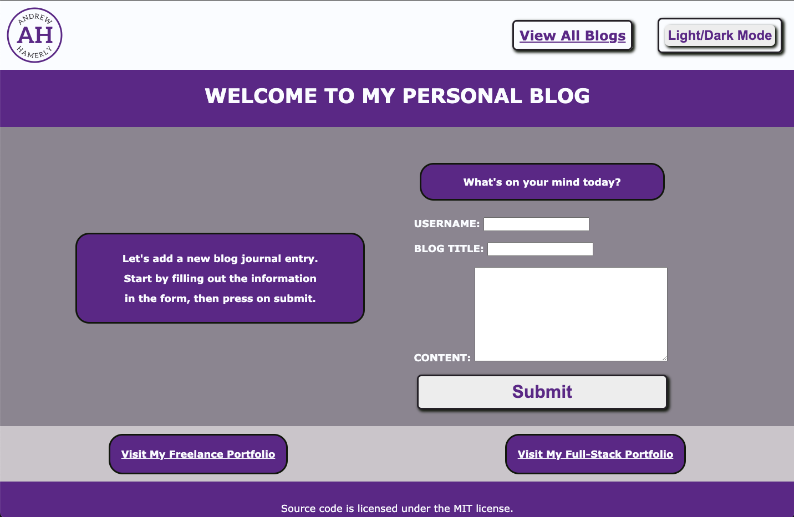

# Blog

## Description
This project was created to explore the concepts of WEB APIs using localStorage and persistant data with blog journals.

## Installation
To install this repo, simply copy the repo and use git clone in your command line along with the copied repo url with your preferred method.

```bash
git clone git@github.com:andrewhamerly/blog.git
```

## Usage
This can be used to record and store personal journal entries by the author to reflect on later.

Link to deployed application:
[Blog](https://andrewhamerly.github.io/blog/)



## Credits
ChatGPT to help me trouble shoot and correct an error with adding multiple objects in an array to the localStorage.
This is the specific code it helped me to generate:
   `let storedData = localStorage.getItem('blogContent');
    let blogContentArry = storedData ? JSON.parse(storedData) : [];

    if (!Array.isArray(blogContentArry)) {
        blogContentArry = [];
    }`

## License
Source code is licensed under the MIT license.
Contents of this site are Copyright © 2024 by Andrew Hamerly.
All Content Rights Reserved.
